# Saarthi — Proactive Digital Engagement Co-Pilot for YONO SBI

[](https://invexora.github.io/saarthi-yono-copilot/)
[](http://localhost:5050/api/v1/health)
[](docs/ARCHITECTURE.md#4-dpdp-act-2023-privacy--consent-guardrails-engine)

Saarthi is a governed proactive-engagement reference prototype designed for a future **YONO SBI** integration. It detects synthetic customer signals and demonstrates policy-controlled recommendations; it is not currently connected to SBI systems or approved for customers.

Built for the **YONO Copilot Hackathon**, Saarthi provides a high-fidelity experience prototype and a pilot-oriented backend foundation. It demonstrates privacy and fair-engagement controls inspired by the **Digital Personal Data Protection (DPDP) Act 2023** and RBI guidance; formal compliance remains subject to SBI legal, security, risk, and architecture review.

---

## 🌐 Live Deployed Application & Walkthrough

*   🚀 **Live Deployed Prototype:** [**https://invexora.github.io/saarthi-yono-copilot/**](https://invexora.github.io/saarthi-yono-copilot/)
*   💻 **Local Web Server:** `http://127.0.0.1:8000`
*   ⚙️ **Backend Decision Engine:** `http://127.0.0.1:5050` (FastAPI / LangGraph)
*   📖 **Interactive Runbook:** [docs/DEMO_RUNBOOK.md](docs/DEMO_RUNBOOK.md)
*   📊 **Presentation Pack:** `presentation.html`

---

## 🏛️ System & SLM Architecture Blueprints

Comprehensive architectural blueprints, Small Language Model (SLM) training/inference pipelines, DPDP guardrails, and Agentic Traffic Controller (ATC) state machine diagrams are documented in **[docs/ARCHITECTURE.md](docs/ARCHITECTURE.md)**:

| Architectural Component | Blueprint & Specification | Visual Architecture Diagram |
| :--- | :--- | :--- |
| **1. End-to-End System** | [docs/ARCHITECTURE.md#1-end-to-end-system-architecture](docs/ARCHITECTURE.md#1-end-to-end-system-architecture) | 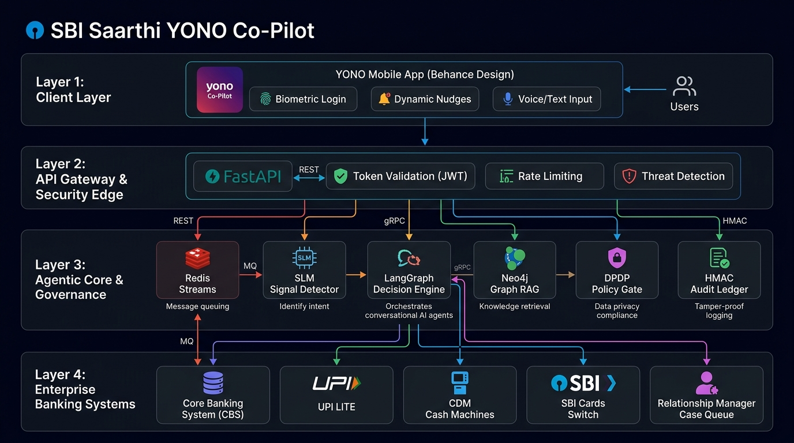 |
| **2. Small Language Model (SLM)** | [docs/ARCHITECTURE.md#2-small-language-model-slm-architecture--signal-detection](docs/ARCHITECTURE.md#2-small-language-model-slm-architecture--signal-detection) | 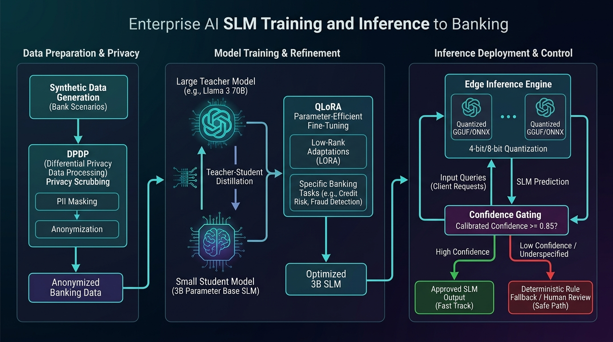 |
| **3. Agentic Traffic Controller (ATC)** | [docs/ARCHITECTURE.md#3-agentic-traffic-controller-atc--decision-orchestrator](docs/ARCHITECTURE.md#3-agentic-traffic-controller-atc--decision-orchestrator) | 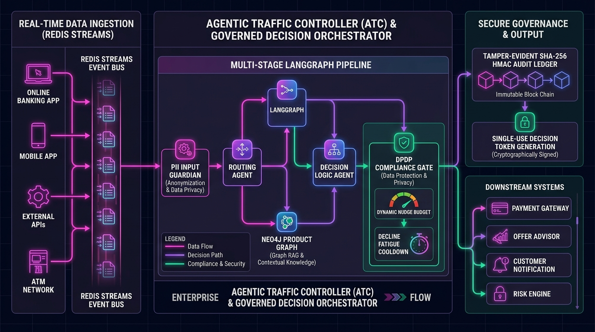 |
| **4. DPDP Privacy & Consent Guardrails** | [docs/ARCHITECTURE.md#4-dpdp-act-2023-privacy--consent-guardrails-engine](docs/ARCHITECTURE.md#4-dpdp-act-2023-privacy--consent-guardrails-engine) | 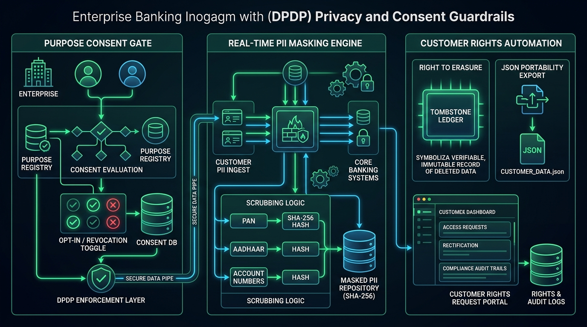 |
| **5. Dynamic Nudge Budget & Fatigue Controller** | [docs/ARCHITECTURE.md#5-dynamic-nudge-budget--decline-fatigue-control-system](docs/ARCHITECTURE.md#5-dynamic-nudge-budget--decline-fatigue-control-system) | 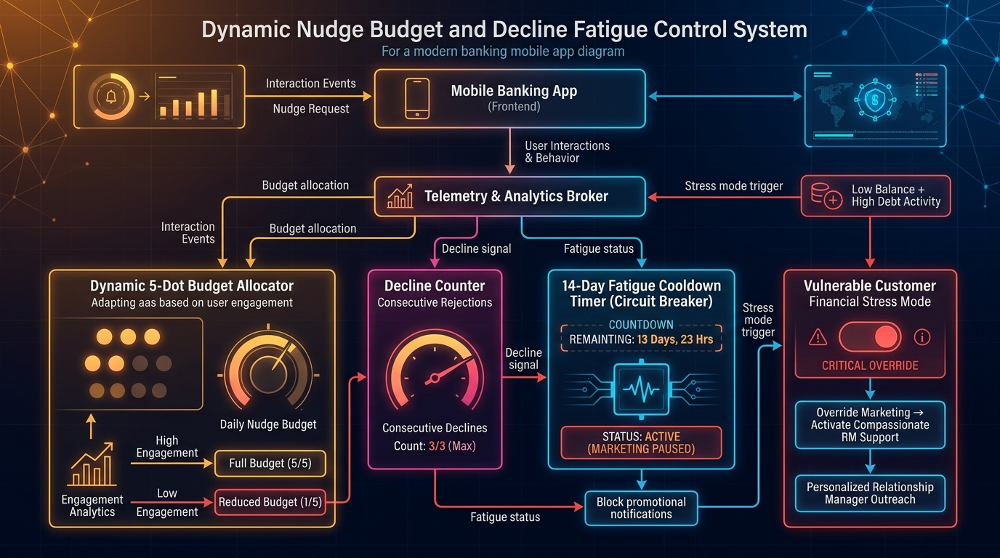 |
| **6. Cryptographic Audit Merkle Ledger** | [docs/ARCHITECTURE.md#6-cryptographic-audit-ledger--single-use-decision-tokens](docs/ARCHITECTURE.md#6-cryptographic-audit-ledger--single-use-decision-tokens) | 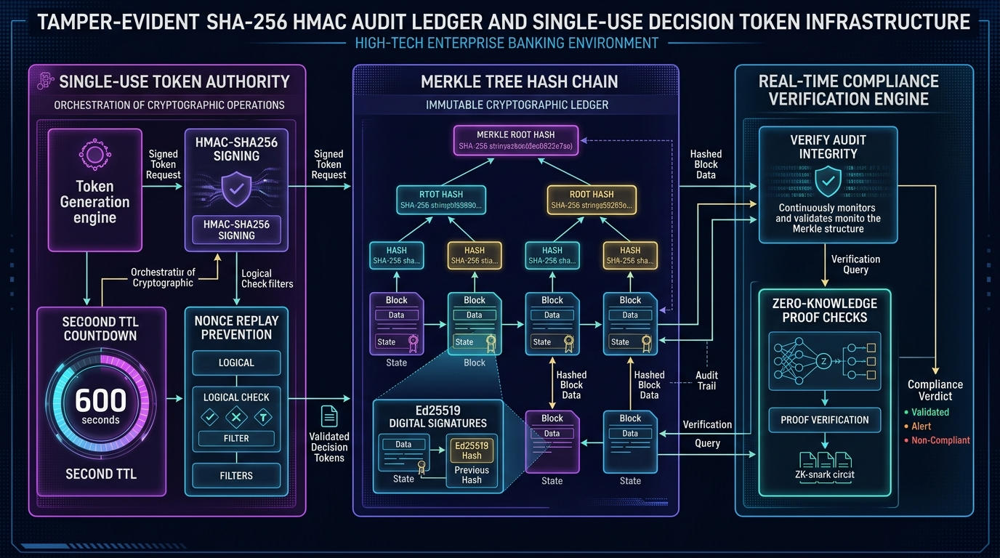 |
| **7. Neo4j Knowledge Graph RAG Matrix** | [docs/ARCHITECTURE.md#7-neo4j-knowledge-graph-rag--product-matrix](docs/ARCHITECTURE.md#7-neo4j-knowledge-graph-rag--product-matrix) | 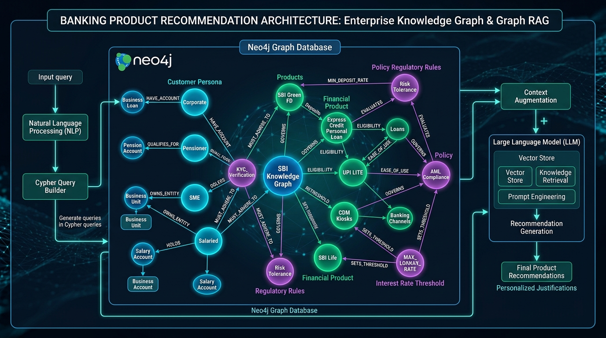 |

---

## 📱 Banking App & In-App Nudge Screenshot Gallery

A comprehensive visual gallery containing **19 high-resolution screenshots** across all screens, sub-views, and proactive nudge states is documented in **[docs/SCREENSHOTS.md](docs/SCREENSHOTS.md)**:

| MPIN & Biometrics Login | Magenta Wave Card Dashboard | Governed Opportunity Nudge |
| :---: | :---: | :---: |
| [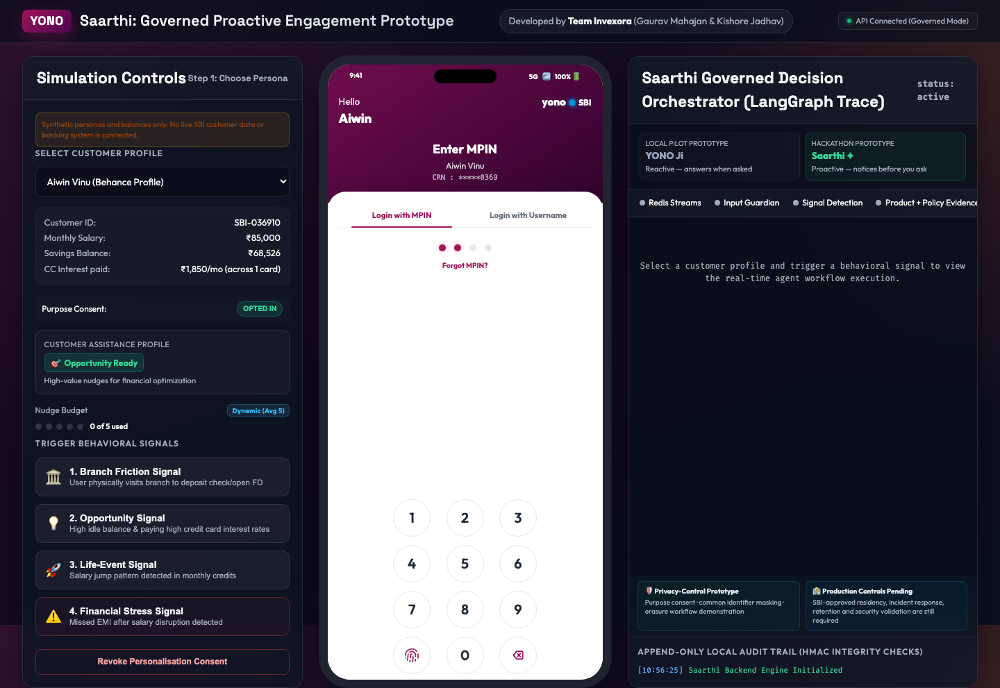](docs/SCREENSHOTS.md) | [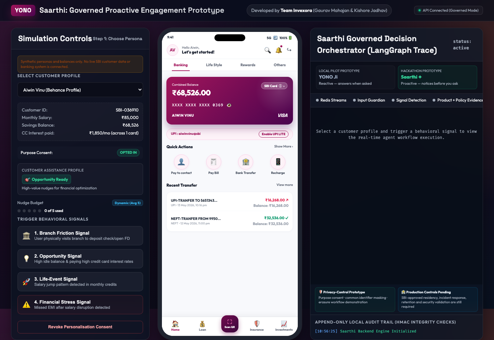](docs/SCREENSHOTS.md) | [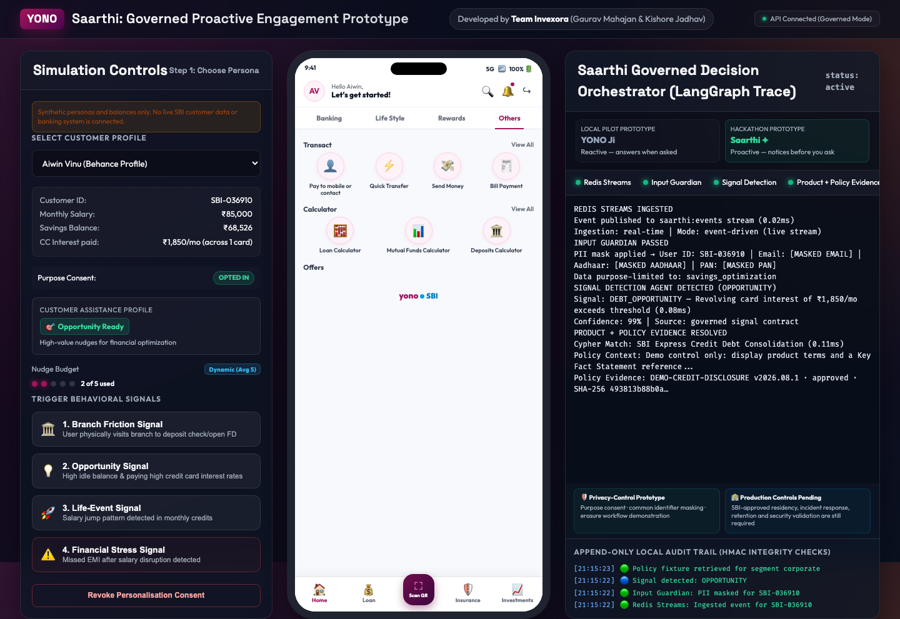](docs/SCREENSHOTS.md) |
| **Account Details / Profile** | **Financial Stress Mode** | **Explainability Accordion** |
| [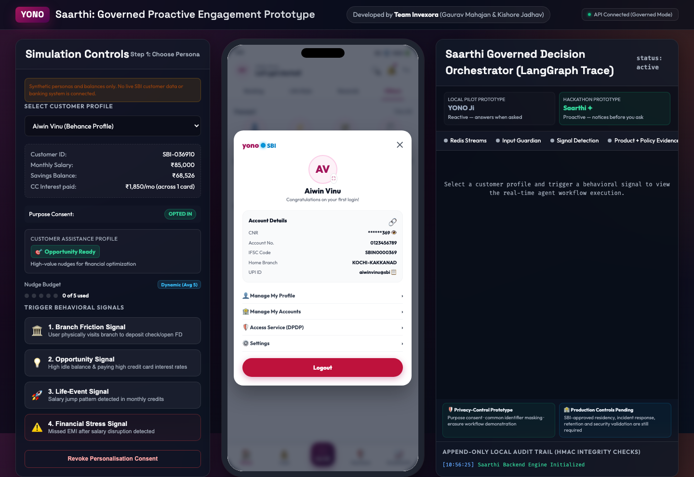](docs/SCREENSHOTS.md) | [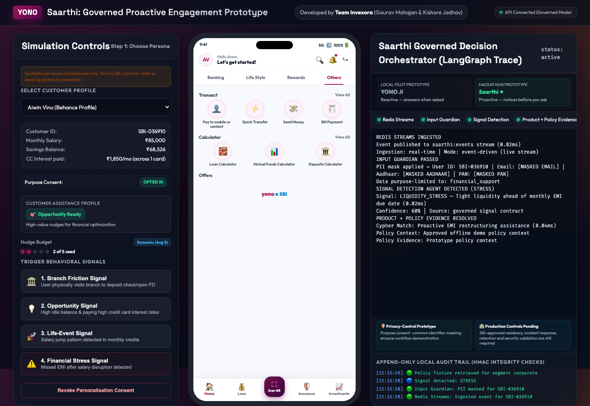](docs/SCREENSHOTS.md) | [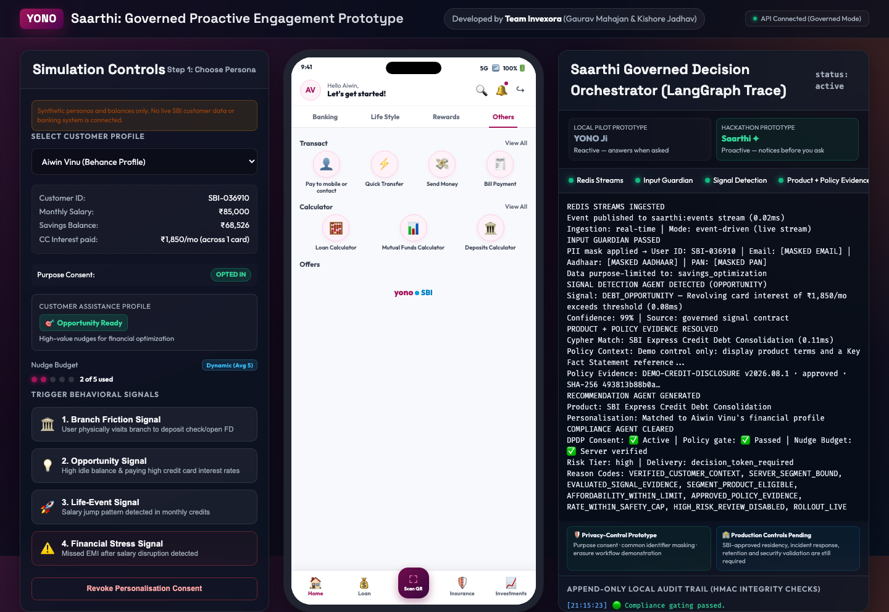](docs/SCREENSHOTS.md) |

👉 **[View all 19 Full-Resolution Screenshots in docs/SCREENSHOTS.md](docs/SCREENSHOTS.md)**

---

## 🛠️ Repository Architecture

The project is organized as a modular, pilot-oriented reference implementation:

```
saarthi-yono-copilot/
├── index.html               # Authentic Behance YONO Simulator UI (Mobile + LangGraph Trace)
├── style.css                # Extracted visual styles (glassmorphism & dark mode)
├── app.js                   # Interactive client-side simulation, states & routing
├── backend/                 # Governed decision-orchestration reference backend
│   ├── requirements.txt     # Python backend dependencies
│   ├── api.py               # Versioned FastAPI REST endpoints
│   ├── database.py          # Consent, nudge budgets, recommendations and audit persistence
│   ├── dpdp_engine.py       # Consent lifecycle and scoped action authorization
│   ├── signal_detection.py  # SLM & rule-based behavioral signal detector
│   ├── orchestrator.py      # Compiled LangGraph 6-node state-machine
│   └── ml/                  # SLM dataset generation, fine-tuning and evaluation
├── docs/                    # Complete Architecture, SLM Roadmaps, Runbooks, SVGs & Images
│   ├── ARCHITECTURE.md      # Comprehensive Architectural Blueprint
│   ├── diagrams/            # Vector SVGs (SLM, ATC, Full System)
│   └── images/              # High-Resolution Architectural Renders
├── signal-lm-training-kit/  # Standalone PyTorch/Transformers QLoRA Training Kit
├── tests/                   # Trust-control unit and API integration tests
└── README.md                # Premium architectural description (this file)
```

---

## ⚙️ Core Technical Features

### 1. Governed Orchestrator Reference Implementation
The orchestrator manages customer signals through modular processing nodes using a typed `GraphState` and a compiled LangGraph workflow:
*   **Input Guardian Node:** Recursively masks eight identifier classes across supported text and structured fields before downstream prototype processing.
*   **Signal Detection Node:** Scans transaction streams for trigger events (e.g. cash deposits, recurring card interest fees, salary credit jumps).
*   **Product Recommender Node:** Uses 20 versioned signal/segment mappings across 16 synthetic demo actions, with interchangeable in-memory and Neo4j adapters. These are not approved SBI SKUs.
*   **Policy Node:** Applies deterministic prototype disclosure, consent, affordability and vulnerability rules. SBI policy mapping and control-owner approval remain pending.

### 2. Privacy and Consent Gating Prototype
Saarthi implements technical privacy controls inspired by the Indian Digital Personal Data Protection framework. Formal applicability, notices, retention and legal compliance require SBI review:
*   **Consent Revocation:** Disables profiling and promotional engagement without conflating revocation with erasure.
*   **Erasure Workflow:** Removes eligible Saarthi-derived local personalization, recommendation, budget, and operational-audit data while retaining a minimal revoked-consent tombstone and integrity-ledger evidence. It does not claim to erase unrelated SBI records.
*   **Data Export:** Allows customers to download the prototype's stored profiling history as JSON. The legal basis and final export schema require SBI review.
*   **Scoped Authorization:** Recommendations follow a durable `pending_review → approved → presented → authorized → executing → fulfilled` lifecycle. Explicit action consent produces a short-lived, single-use server authorization token only after presentation.

### 3. Dynamic YONO Emulator
The web interface features a fully functional phone simulator running an interactive YONO UI:
*   **YONO Pay:** Tracks transfers and UPI logs.
*   **Investments:** Displays savings balances and portfolio values.
*   **Cards:** Displays synthetic outstanding and minimum-due fixtures while marking live pricing as an SBI feed dependency.
*   **Loans & Insurance:** Renders synthetic product and service fixtures for the prototype; these are not live or pre-approved SBI offers.
*   **Services:** Prototype control center for purpose consent, eligible-data erasure and data export.

---

## 💻 Running the Project Locally

### Running the Web Simulator
To launch the interface without the API, run a simple web server from the repository root and opt into explicit simulation mode:

```bash
# Start Python's built-in HTTP server
python3 -m http.server 8000
```
Then navigate to [http://localhost:8000/?mode=offline-demo](http://localhost:8000/?mode=offline-demo). The status bar marks this mode as simulation-only and no banking action occurs. Opening the UI without this flag requires the governed API; an API outage fails closed instead of silently simulating success.

### Running the integrated container stack

The Compose stack starts the FastAPI service, independently health-checked event worker, YONO web simulator, PostgreSQL, Redis Streams, and Neo4j:

```bash
docker compose up --build
```

Open [http://localhost:8000](http://localhost:8000). Local Compose defaults are deliberately marked development-only; use secrets supplied by an approved secret manager outside local development.

### Running the Python Backend
The `/backend` directory contains functional code simulating the agent pipeline.

1.  **Install dependencies:**
    ```bash
    pip install -r backend/requirements.txt
    ```
2.  **Start the versioned API in local development identity mode:**
    ```bash
    SAARTHI_AUTH_MODE=development \
    SAARTHI_DECISION_SECRET=local-development-secret-at-least-32-chars \
    PORT=5050 \
    python3 -m backend.server
    ```
    Production requires OIDC/JWKS authentication with an HTTPS key-set URL, asymmetric algorithm allowlist, issuer, and audience configuration. HS256 remains available only for non-production compatibility. The API derives the customer ID from the verified identity; request bodies cannot select another customer.
    Generated OpenAPI documentation is available at [http://localhost:5050/docs](http://localhost:5050/docs); the identity and endpoint contract is summarized in [docs/API.md](docs/API.md).
3.  **Run the automated trust-control and browser-contract suites:**
    ```bash
    python3 -m pytest -q
    node --test tests/frontend/*.test.mjs
    ```
4.  **Generate Synthetic Customer Transaction Logs:**
    ```bash
    python3 backend/data_synthesis.py
    ```
5.  **Validate the local manifest-backed policy catalogue:**
    ```bash
    python3 backend/vector_ingestion.py
    ```
6.  **Run the orchestrator pipeline directly:**
    ```bash
    python3 backend/orchestrator.py
    ```

---

## 🔒 Implemented Trust Controls
*   **Production OIDC/JWKS contract:** The verifier supports rotating asymmetric keys, issuer/audience validation, required claims, and role extraction; production configuration rejects shared-secret identity mode. No SBI identity tenant is connected.
*   **Server-authoritative purpose consent:** Profiling is blocked before signal processing when personalization consent is absent.
*   **PII response boundary:** Raw inbound details are never returned by the orchestration API.
*   **Atomic nudge budget:** At most two promotional nudges are reserved per 14-day cycle; support interventions do not consume the budget.
*   **Retry-safe orchestration:** Required idempotency keys deduplicate both the API result and Redis event publication.
*   **Single-use action authorization:** Presented recommendations must be explicitly authorized before a server HMAC token is issued; only its digest is persisted or shown in trace output.
*   **Revocation/erasure separation:** The two customer actions have distinct backend semantics.
*   **Governed policy evidence:** Retrieval uses a hash-validated manifest and returns policy ID, version, approval owner, effective dates, source, and content digest.
*   **Tamper-evident integrity ledger:** Governance events use pseudonymous customer references and an append-only HMAC hash chain that survives customer-data erasure.
*   **Independent high-risk review:** Deployments can require durable reviewer approval before a high-risk recommendation becomes customer-authorizable.
*   **Deterministic decision envelope:** Product eligibility, policy provenance, rate caps, vulnerability routing, and human oversight produce reproducible outcomes and reason codes.
*   **Trusted customer context:** Production uses an SBI-owned context API; local development uses visibly synthetic records. Segment binding, freshness, affordability, and vulnerability checks run on server-sourced data without returning raw financial values.
*   **Governed offer delivery:** Approved high-risk offers remain hidden until customer retrieval atomically reserves engagement budget. Replays, cross-customer access, expiry, revocation, and concurrent delivery are enforced server-side.
*   **Confirmed fulfilment contract:** Customer authorization and downstream execution are separate states. A token-bound, idempotent fulfilment adapter must return a downstream reference before the UI reports success; local development labels the synthetic provider and only token hashes are retained.
*   **Downstream reconciliation:** Every completed action creates a durable verification record. The worker re-queries the provider, distinguishes matched, pending, unavailable, reversed, failed, and reference-mismatch outcomes, and keeps discrepancies open even after an administrator acknowledges them.
*   **Four-eyes case escalation:** A reconciliation mismatch can become an SBI operations case only after one authenticated operator requests it and a different administrator approves it. Submission and status synchronization are idempotent, retry-safe, data-minimized, and never execute financial compensation.
*   **Controlled rollout:** Durable global, channel, segment, signal, product, and exact model-version controls provide deterministic cohorts, non-customer-visible shadow evaluation, four-eyes activation, and an immediate administrator kill switch. Active controls are rechecked before presentation, authorization, and fulfilment so in-flight offers cannot bypass containment.
*   **Outcome monitoring:** Idempotent, pseudonymous feedback observations measure conversion, complaints, opt-outs, false positives, benefit, and harm. Aggregate segment/signal/product reports enforce minimum samples and surface threshold breaches without exposing customer or raw source-event identifiers.
*   **Versioned signal detection:** Masked signals flow through an evaluated detector contract with confidence, model/schema versions, reason codes, and input-digest binding. Production requires the SBI adapter and fails closed on low confidence, unapproved models, schema mismatch, or dependency failure.
*   **Signed product and policy artifacts:** Product rules and policy registries can be submitted only as Ed25519-signed canonical envelopes from the configured SBI trust anchor. Activation is four-eyes, durable, restart-safe, and rolls back runtime materialization if activation cannot be committed.
*   **Server-owned customer presentation:** Connected-mode product, action, consent, and success copy is persisted with the governed recommendation. The browser verifies the recommendation/product identity through presentation, authorization, fulfilment, and success; local scenario copy is restricted to explicit offline simulation.
*   **Recoverable event processing:** Redis consumer groups provide explicit acknowledgements, stale-message claims, bounded retries, privacy-safe dead-letter views, idempotent admin replay, and lag/pending/dead-letter SLO metrics.
*   **Durable event evidence:** A separately deployable worker validates approved event schemas and writes exactly-once receipts containing only a pseudonymous customer reference and payload digest. Worker heartbeats participate in readiness so a configured-but-dead consumer cannot appear healthy.

The container stack supports PostgreSQL persistence, recoverable Redis Streams event delivery, continuous fulfilment reconciliation, Neo4j product rules, signed governed policy/product artifacts, mandatory high-risk review, compiled LangGraph decision execution, OIDC/JWKS verification, and typed SBI customer-context and fulfilment adapters. Local development retains SQLite/in-memory and explicitly synthetic adapters. SBI environment connection/certification, production trust-key custody, CBS/CRM/fulfilment integration, outcome feeds, and an independently operated WORM audit sink remain pending. See the [technical-review demo runbook](docs/DEMO_RUNBOOK.md), [production roadmap](docs/PRODUCTION_ROADMAP.md), [AI/model governance baseline](docs/AI_MODEL_GOVERNANCE.md), and [operations runbook](docs/OPERATIONS_RUNBOOK.md).
