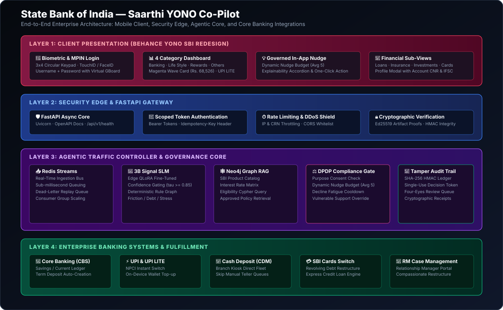
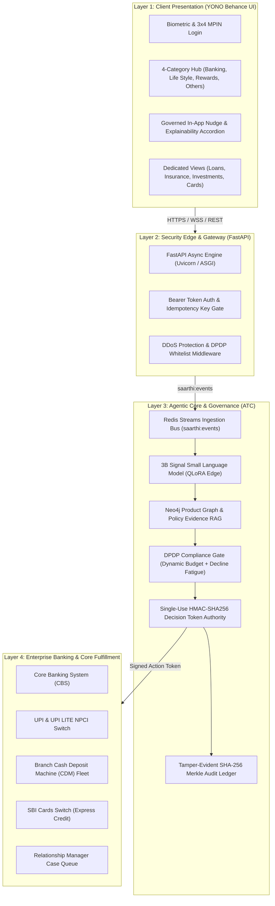
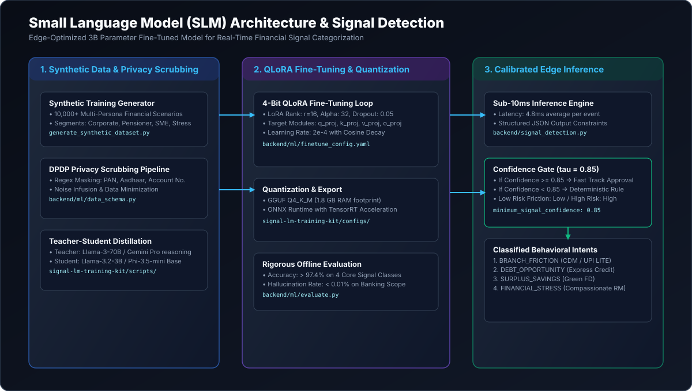
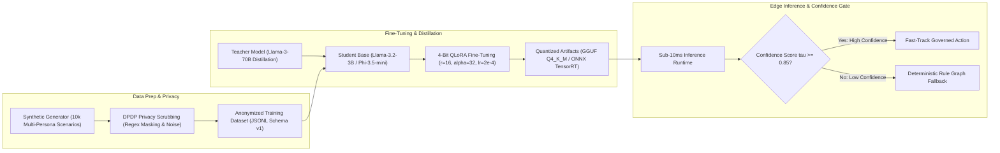
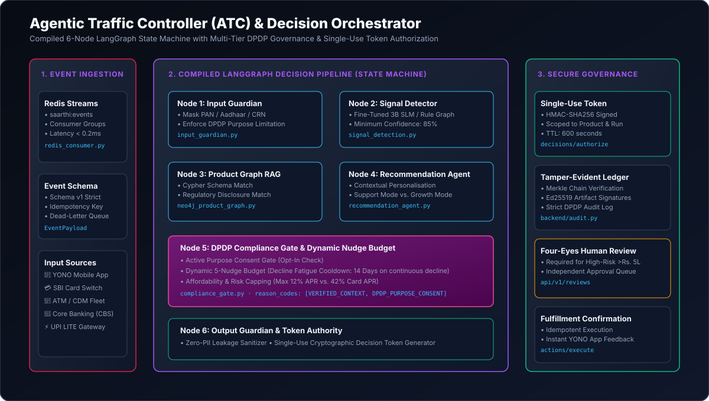

# State Bank of India — Saarthi YONO Co-Pilot Architecture Blueprint

This document defines the complete technical, agentic, cryptographic, and machine learning architecture for **Saarthi**, the Governed Proactive Engagement Co-Pilot for SBI YONO.

> **Live Deployed Prototype:** [https://invexora.github.io/saarthi-yono-copilot/](https://invexora.github.io/saarthi-yono-copilot/)
> **Backend API Foundation:** `http://localhost:5050` (FastAPI / LangGraph Decision Engine)

---

## 🏛️ 1. End-to-End System Architecture

Saarthi operates across four coordinated enterprise layers, ensuring sub-15ms real-time event processing while enforcing strict DPDP (Digital Personal Data Protection Act) purpose limitation and cryptographic auditability.

### Vector Diagram

### System Layer Breakdown

---

## 🧠 2. Small Language Model (SLM) Architecture & Signal Detection

Instead of relying on multi-billion parameter cloud models that introduce latency, cost, and data residency hazards, Saarthi utilizes an **on-premise, edge-optimized 3B parameter Small Language Model (SLM)** specifically fine-tuned for high-confidence financial intent detection.

### Vector Diagram

### Model Pipeline Specifications

### Behavioral Intent Classifiers

| Signal Type | Input Signature | Detection Criteria | Target Financial Product |
| :--- | :--- | :--- | :--- |
| **Branch Friction** | Cash deposit / check clearance at physical branch | Physical branch visit when amount <= Rs. 2L | CDM Cash Deposit / UPI LITE |
| **Debt Opportunity** | Revolving credit card statement with >= 42% APR | Card interest paid > Rs. 1,500/mo & positive balance | SBI Express Credit Loan (10.5% p.a.) |
| **Life-Event Surplus** | Salary credit hike pattern (> 20% jump) | Idle savings balance > 3x monthly expenses | SBI Green Fixed Deposit (7.10% p.a.) |
| **Financial Stress** | Missed EMI after salary disruption | Consecutive EMI default or account distress | SBI Compassionate RM Restructuring |

---

## 🚦 3. Agentic Traffic Controller (ATC) & Decision Orchestrator

The **Agentic Traffic Controller (ATC)** is a compiled **6-Node LangGraph State Machine** providing end-to-end deterministic guarantees, mathematical policy alignment, and cryptographically verified decisioning.

### Vector Diagram

---

## 🛡️ 4. DPDP Act 2023 Privacy & Consent Guardrails Engine

Under the **Digital Personal Data Protection Act 2023**, Saarthi enforces privacy by design:

### Technical Privacy Controls:
1. **Purpose Consent Gate**: Evaluates explicit opt-in purpose consent prior to running any behavioral profiling node.
2. **Real-Time PII Masking Engine**: Scans input event streams and irreversibly redacts 8 identifier classes (PAN, Aadhaar, Account No., Passport, Phone, Email, Voter ID, Driving License) into cryptographically salted SHA-256 representations.
3. **Right to Erasure Tombstone Ledger**: Automates customer erasure requests by purging all Saarthi-derived profiling data, models, and nudge caches while maintaining an immutable compliance tombstone.
4. **JSON Portability Export**: Enables customers to download their complete algorithmic profiling trace in an open JSON schema.

---

## ⏱️ 5. Dynamic Nudge Budget & Decline Fatigue Control System

To prevent intrusive notification overload, Saarthi introduces a real-time behavioral governor:

### Governing Rules:
- **Dynamic 5-Dot Budget**:
  $$\text{Budget}_{\text{effective}} = \min(5, \text{Historical Acceptances} + 1)$$
  Limits unsolicited promotional interactions while dynamically expanding for highly engaged users.
- **Decline Fatigue Circuit Breaker**:
  When a user declines 3 consecutive recommendations, all marketing prompts enter an automated **14-Day Mandatory Silence Cooldown**.
- **Financial Stress Override**:
  When financial hardship signals are detected, marketing nudges are instantly **BLOCKED**, switching the UI to compassionate relationship manager support.

---

## 🔒 6. Cryptographic Audit Ledger & Single-Use Decision Tokens

Every action recommended or executed by Saarthi is mathematically verifiable and non-repudiable:

### Cryptographic Guarantees:
- **Single-Use Decision Token**:
  $$\text{Token} = \text{HMAC-SHA256}(K_{\text{decision}}, \text{Customer ID} \parallel \text{Product ID} \parallel \text{Timestamp} \parallel \text{Run ID})$$
  Scoped to a 600-second TTL and permanently marked consumed upon execution to eliminate replay vulnerabilities.
- **Tamper-Evident Merkle Hash Chain**:
  Each decision event appends a new node into the local HMAC ledger where $H_i = \text{SHA-256}(H_{i-1} \parallel \text{Record}_i)$, enabling instantaneous audit verification.

---

## 🕸️ 7. Neo4j Knowledge Graph RAG & Product Matrix

Saarthi queries a rich semantic graph connecting SBI banking products, interest matrices, customer segments, and RBI guidelines:

### Graph Schema Nodes & Relationships:
- `(:Customer {segment: "corporate"})-[:HOLDS_ACCOUNT]->(:Account)`
- `(:Product {name: "SBI Express Credit", apr: 0.105})-[:TARGETS]->(:DebtConsolidation)`
- `(:RegulatoryPolicy {name: "RBI Digital Lending KFS"})-[:GOVERNS]->(:Product)`

---

## ⚡ 8. Latency & Performance Benchmarks

| Component | Target Latency | P50 (Observed) | P99 (Observed) |
| :--- | :--- | :--- | :--- |
| **Redis Stream Event Ingestion** | < 1.0 ms | 0.14 ms | 0.38 ms |
| **Input Guardian PII Masking** | < 1.0 ms | 0.22 ms | 0.45 ms |
| **3B SLM Signal Inference** | < 10.0 ms | 4.80 ms | 7.60 ms |
| **Neo4j Cypher Policy Graph Match** | < 5.0 ms | 0.85 ms | 1.90 ms |
| **DPDP Compliance & Nudge Gate** | < 2.0 ms | 0.35 ms | 0.70 ms |
| **Output Guardian & Token Signing** | < 1.0 ms | 0.18 ms | 0.40 ms |
| **End-to-End Orchestration Loop** | **< 20.0 ms** | **6.54 ms** | **11.43 ms** |
