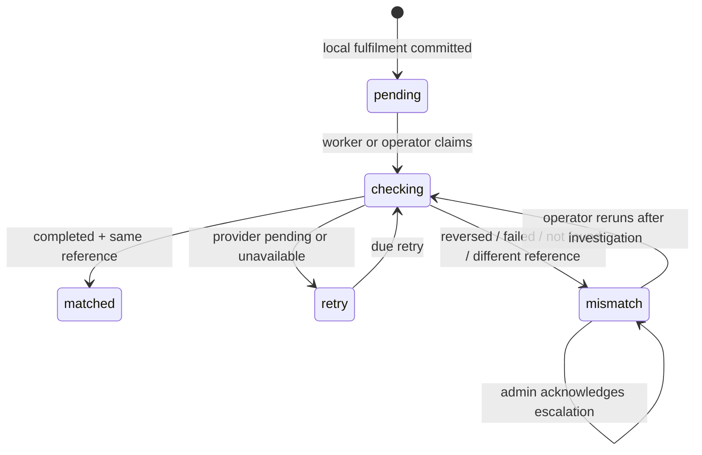
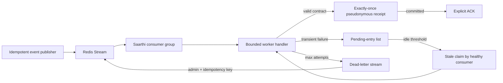
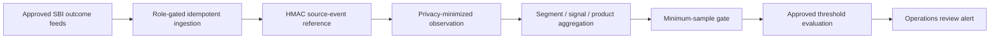

# Saarthi Governed Decision Architecture

## Trust boundaries

The browser supplies a behavioral signal and, only in local development, a segment hint. Customer identity comes from the authenticated session. Production eligibility uses the SBI customer-context adapter; caller-supplied segment and financial values are never trusted.

The context contract provides a verified segment, monthly income and obligations, vulnerability flags, source, version, and timestamp. Raw financial values remain inside the decision service. Public responses and reviewer records contain only provenance, calculated ratios, policy evidence, and reason codes.

## Decision flow

```mermaid
flowchart LR
    Y["Authenticated YONO session"] --> K["Global + channel rollout gate"]
    K --> C["Purpose-consent gate"]
    C --> X["SBI customer context"]
    X --> SG["Trusted-segment rollout gate"]
    SG --> S["Signal classification"]
    S --> G["Effective-dated product graph"]
    G --> P["Approved policy retrieval"]
    P --> PG["Signal + product rollout gate"]
    PG --> D["Deterministic safety envelope"]
    D -->|"stress or vulnerability"| U["Support only"]
    D -->|"failed gate"| R["Reject with reason codes"]
    D -->|"low risk"| L["Present governed offer"]
    D -->|"high risk"| H["Independent review queue"]
    H --> A["Approved"]
    A --> L
    L --> E["Explicit customer action consent"]
    E --> T["Single-use decision token"]
    T --> F["Idempotent SBI fulfilment"]
    F --> Z["Confirmed downstream reference"]
```

## Controlled rollout governance

Rollout controls are durable and hierarchical across `global`, `channel`, `segment`, `signal`, `product`, and exact `model` scopes. Model scope values use the immutable `model_id:model_version` evidence stored with the decision. A matching `disabled` control always wins. Otherwise a matching `shadow` control, or exclusion from an `active` control's deterministic cohort, routes the decision to shadow mode. Customer membership is stable because the cohort bucket is an HMAC of the customer and control IDs; raw identifiers are never stored in the control record.

Normal changes are four-eyes: an operator or administrator requests a control and a different administrator approves or rejects it. Approval atomically supersedes the previous active control for that exact scope. An administrator can apply an immediate emergency disable because safety shutdown must not wait for a second actor; restoring customer-visible activity still requires a separately requested and approved `active` control.

The global/channel gate runs before consent lookup and behavioral profiling. Trusted-segment controls run after server-side context resolution, while signal/product/model controls run after the internal decision has identified those values. Shadow decisions publish the internal trace and append audit evidence, but consume no nudge budget, create no recommendation or review record, expose no product/rate/policy output, and cannot be presented, authorized, or fulfilled. Existing recommendations reconstruct their original model identity from stored signal evidence and are re-evaluated at presentation, authorization, and execution, so a model switch cannot be bypassed by an in-flight journey. A previously fulfilled replay remains idempotently readable and never calls the provider again.

## Versioned signal detection

Signal classification is an injected service contract rather than an inline graph heuristic. The input guardian masks the signal before the detector sees it. Every accepted classification contains a category, confidence, model ID and version, feature-schema version, bounded reason codes, evaluation identity/status, and a SHA-256 digest binding the response to that exact masked input. The deterministic policy rejects missing, mismatched, or unevaluated signal evidence before product delivery.

Local and integrated-demo mode use `saarthi-signal-rules:2026.08.3`. Versioned demo signal codes are the deterministic contract, while an explicit phrase catalogue and conservative stress fallback handle unstructured prototype inputs. Its executable 20-journey synthetic contract publishes accuracy, macro precision/recall, five-row per-category support, and limitations. This corpus protects integrated demo behavior during development but is not production-population validation.

Production requires `SAARTHI_SIGNAL_DETECTION_MODE=sbi_api`. The SBI adapter sends only the masked signal, input digest, and supported feature-schema version. It rejects low confidence, unknown categories, unsupported schemas, input-digest mismatch, incomplete reason codes, or any model whose evaluation status is not `approved`. Detector outages fail the orchestration request before recommendation persistence or budget consumption and release request idempotency for a safe retry. Readiness includes detector health, and authenticated governance roles can inspect the active evaluation envelope.

## Signed artifact governance

Product eligibility rules and the policy registry are runtime-governed artifacts. In signed mode each submission is a compact canonical JSON envelope with `artifactType`, `version`, and `payload`, signed with Ed25519 by the configured SBI key ID. The service verifies the signature, payload schema, effective windows, duplicate identifiers, policy content digests, and SHA-256 envelope digest before storing the artifact. Public API responses expose only metadata and digests; signatures, envelopes, and actor references stay server-side.

Activation is four-eyes. An operator or administrator can request a signed artifact, but a different administrator must approve it. Approval first claims the artifact as `materializing`, verifies the stored digest and signature again, applies the product or policy feed to the runtime adapter, and then commits the database activation. If materialization fails, the artifact returns to `pending`; if the database commit fails after runtime application, the previous active artifact or runtime snapshot is restored. Startup calls the same verifier/materializer for active artifacts, so signed mode readiness fails closed when either the product catalog or policy registry is missing or cannot be trusted.

Local prototype mode can still boot from bundled in-memory product and policy data. Production validation requires `SAARTHI_ARTIFACT_FEED_MODE=signed`, `SAARTHI_ARTIFACT_SIGNING_PUBLIC_KEY`, and `SAARTHI_ARTIFACT_SIGNING_KEY_ID`; key custody, rotation ceremony, and SBI feed transport remain deployment responsibilities.

## Offer state machine

```mermaid
stateDiagram-v2
    [*] --> pending_review: high-risk recommendation
    pending_review --> rejected: reviewer rejects
    pending_review --> approved: reviewer approves
    approved --> presented: customer retrieves; budget reserved
    presented --> authorized: explicit action consent
    authorized --> executing: token-bound execution claim
    executing --> fulfilled: downstream completion confirmed
    executing --> authorized: transient failure; safe retry
    pending_review --> expired
    approved --> expired
    presented --> expired
```

Product and rate details are withheld while an offer is `pending_review`. Authorization is rejected until the record is `presented`. Presentation is customer-scoped, expiry-aware, consent-gated, concurrency-safe, and consumes the two-per-14-day engagement budget exactly once.

Authorization is not fulfilment. Decision tokens are stored only as hashes and are accepted for execution for five minutes. A transactional claim gives one caller ownership; the recommendation ID is also the downstream idempotency key. Only a confirmed provider reference moves the action to `fulfilled` and triggers the customer success state.

## Fulfilment reconciliation

The local customer-facing fulfilment state and the operational reconciliation state are intentionally separate. A later downstream reversal does not rewrite history or silently tell the customer that execution never occurred; it opens a discrepancy for SBI operations. The stored reconciliation contains no customer ID and no provider response body. It retains the recommendation ID, expected reference, provider status, response digest, attempts, timing, and a PII-masked acknowledgement note. Exactly one checker owns a record at a time, and stale claims are recoverable.

## Operations case escalation

```mermaid
stateDiagram-v2
    [*] --> draft: operator requests from mismatch
    draft --> approved: different admin approves
    approved --> submitting: worker claims
    submitting --> submission_retry: provider unavailable
    submission_retry --> submitting: due retry; same case ID
    submitting --> open: SBI case accepted
    open --> syncing: scheduled status check
    syncing --> sync_retry: provider unavailable
    sync_retry --> syncing: due retry
    syncing --> in_progress
    syncing --> resolved
    syncing --> closed
    syncing --> rejected
```

Requester and approver identities are stored only as HMAC references. The database enforces one case per reconciliation, while row-level claims prevent duplicate provider calls and make crash recovery safe. The adapter sends the case ID, recommendation ID, fulfilment reference, fixed category/priority, and masked summary—never the customer ID. The workflow can open and observe a case, but has no capability to refund funds, reverse a banking ledger, modify settlement records, or self-certify resolution.

## Event delivery and recovery

Workers never acknowledge a failed handler invocation. The deployed handler accepts only the versioned `ORCHESTRATOR_TRACE` shape (`signal` and `segment`), then commits an event-ID-keyed receipt containing the event type, HMAC customer reference, SHA-256 payload digest, consumer name, and processing time. It stores neither the raw customer ID nor payload. If a process dies after commit but before acknowledgement, the replacement sees the existing receipt and safely acknowledges without duplicating the projection.

Pending entries can be reclaimed after an idle threshold, and an event is atomically moved and acknowledged only after its delivery limit is reached. Operator APIs expose event type and failure class but omit customer IDs, payloads, and exception messages. Replay is admin-only, deduplicated, and audit-ledgered. Prometheus gauges and `/api/v1/events/status` report lag, pending entries, dead letters, active heartbeats, durable receipts, and whether configured SLO thresholds are met. Redis-mode API readiness fails when there is no current consumer heartbeat.

## Outcome and disparity monitoring

Outcome observations are linked to an existing governed recommendation and can represent conversion, decline, complaint, opt-out, false positive, benefit, or harm. The raw source event ID and evidence body are never stored: source idempotency uses an HMAC reference and source evidence is retained only as a SHA-256 digest. Impact scores are optional, bounded, and directionally validated for benefit and harm. Replays return the original observation; reuse of the same source event for different facts fails as an idempotency conflict.

Reports use unique recommendations as the denominator and unique recommendation/outcome pairs as numerators, preventing duplicated feed events from inflating rates. Alerts are suppressed below the configured minimum sample size. Current dimensions are operational customer segment, signal, and product; the service deliberately neither accepts nor infers protected attributes. Therefore this is disparate-outcome instrumentation, not a claim of protected-class fairness compliance. Production startup requires an explicitly approved monitoring policy, while SBI must still approve definitions, thresholds, attribute governance, source feeds, and remediation ownership.

Observations remain part of customer portability export and are deleted with the linked recommendation during non-regulatory erasure. Aggregate reports contain no customer or source-event identifiers.

## Runtime modes

- `local-prototype`: SQLite, memory Redis/product adapters, approved local policy manifest, and synthetic customer context.
- `integrated-demo`: PostgreSQL, Redis, Neo4j, approved local policy manifest or signed artifacts, mandatory high-risk review, and synthetic context clearly reported by health metadata.
- `production`: validation requires asymmetric OIDC/JWKS authentication, PostgreSQL URL, Redis, Neo4j, signed product and policy artifacts, mandatory review, configured data residency, a separate audit secret, `SAARTHI_CUSTOMER_CONTEXT_MODE=sbi_api`, and `SAARTHI_FULFILLMENT_MODE=sbi_api`.

The remaining SBI deployment work is external-system integration and assurance: connection to SBI's identity tenant, live read models, outcome feeds, and fulfilment; SBI feed transport and trust-key custody; KMS and WORM audit infrastructure; SBI-approved SLO and monitoring thresholds with alert routing; VAPT; model-risk validation; and governed protected-class analysis.
