# SBI Saarthi Finalization Assessment and Plan

Snapshot date: 13 August 2026
Assessment target: an SBI-reviewable, pilot-oriented product solution—not a claim of SBI production deployment.

## Executive verdict

Saarthi is now a coherent governed synthetic-demo product with an unusually substantial backend foundation. It is not yet an SBI-connected pilot or production banking product.

**Baseline implementation status: 58/100 before the finalization work described below.**

**Current implementation status: 68/100 for the complete SBI-facing solution; 90/100 for a demo/technical-review package.** The increase comes from closing the critical customer-action identity defect, verifying all 20 journeys and four golden paths, adding recursive privacy masking and audit redaction tests, defining all 28 internal SBI-boundary application contracts, adding accessibility and model-governance evidence, introducing CI, and completing live connected-browser validation. Production readiness remains approximately **25–30/100** because SBI connectivity, representative data, model-risk approval and infrastructure/security assurance are external and unchanged.

The same repository is approximately:

- **90/100 as a hackathon/demo technical-review package**: the 20-case contract, four executable golden-journey tests, trust boundary, connected browser flows, privacy tests, accessibility contracts and 28-operation boundary are coherent; real assistive-technology/performance evidence and a safe Git checkpoint remain.
- **45/100 at the SBI pilot-entry gate**: strong internal contracts and controls, but no certified SBI integrations, no representative SBI model/data evidence, and incomplete operating assurance.
- **25–30/100 at the SBI production-entry gate**: production credentials, SBI data and fulfilment, infrastructure assurance, model-risk approval, privacy/security certification, scale testing, and operating ownership remain external and incomplete.

### Weighted implementation-completeness score

| Area | Weight | Area score | Contribution | Evidence-based status |
|---|---:|---:|---:|---|
| Product scope and use-case definition | 15 | 86% | 12.9 | Four signal classes, five personas, 20 cases, 16 synthetic action IDs and four repeatable golden journeys are explicit; stress-to-RM case integration remains external. |
| Frontend and demo integration | 15 | 92% | 13.8 | Server-owned presentation binds display, consent, authorization and fulfilment; connected flows and dependency-free accessibility contracts pass. |
| Core decision and governance backend | 25 | 90% | 22.5 | Consent, review, authorization, fulfilment, reconciliation, audit, rollout and signed-artifact foundations exist. |
| Data, AI and model validation | 15 | 48% | 7.2 | The deterministic champion passes the exact 20-row synthetic contract and publishes limitations; no representative SBI model/data validation exists. |
| Privacy and security controls | 10 | 78% | 7.8 | Nested structured masking and audit redaction are tested; enterprise DLP/tokenisation, KMS/HSM, VAPT and DPIA remain. |
| SBI API/platform integration | 10 | 25% | 2.5 | Twenty-eight strict, synthetic-only internal contracts now exist; no InnoHub schema, sandbox or certified SBI endpoint is connected. |
| Production operations and assurance | 10 | 28% | 2.8 | CI and operating designs exist; no verified SBI-like load, HA, DR, backup/restore or operating evidence exists. |
| **Total** | **100** |  | **67.5** | **Coherent governed demo/pilot foundation, not a deployable bank product.** |

This is an implementation-completeness score, not a substitute for readiness gates. A single critical control failure can block a pilot even when the weighted implementation score is higher.

### Implementation checkpoint — current finalization branch

The current finalization branch uses explicit versioned demo signal codes, corrects the reversed SME mappings, adds a dedicated YONO direct-tax demo action, persists server-owned customer presentation evidence, restricts local copy to explicit offline simulation, and verifies recommendation/product identity through presentation, authorization and fulfilment. Automated contracts cover all 20 journeys. Recursive masking now covers structured payloads and audit-ledger payloads, a 28-operation transport-neutral mock boundary is machine-validated, and connected browser QA verified both an executable low-risk path and a non-actionable support path with no console errors.

The repeatable SBI-review script and evidence matrix are in [DEMO_RUNBOOK.md](DEMO_RUNBOOK.md). It executes the two reviewed high-risk fixtures, one low-risk branch-to-digital fixture, support-only routing, privacy controls, reconciliation, fail-closed behavior and the kill switch; it also records that stress-to-RM case creation and an SBI-key-signed live artifact release are not yet executable integrations.

## What exists today

### Implemented stack

| Layer | Current repository | Proposal/deck difference |
|---|---|---|
| Customer UI | Vanilla HTML, CSS and JavaScript YONO simulator | No React/Tailwind application or SBI YONO SDK integration. |
| API | FastAPI, Uvicorn and Pydantic | Substantial typed API exists. |
| Workflow | Deterministic decision graph with LangGraph support | “Multi-agent AI” is not a deployed multi-model agent system. |
| Persistence | SQLite locally; SQLAlchemy/PostgreSQL-compatible implementation | PostgreSQL has not been certified or rehearsed in an SBI environment. |
| Events | In-memory local mode and Redis Streams adapter/worker/DLQ/replay | Redis production operations and capacity are unverified. |
| Product rules | In-memory catalogue and Neo4j adapter | The catalogue contains locally invented demo IDs, names and rates—not an SBI product feed. |
| Policy retrieval | Local document ingestion/retrieval | Pinecone/Weaviate is not implemented and is not needed until SBI approves a platform. |
| Identity/security | Development identity mode plus OIDC/JWKS contract, signed decision/artifact controls | No SBI tenant, KMS/HSM, network or certificate integration. |
| Deployment | Dockerfile and Compose definitions | Docker/Compose runtime was not verified in this workspace. |
| AI/model | Versioned keyword/rules detector and external SBI detector adapter | No trained classifier, ranking/uplift model, LLM provider, model registry or SBI validation dataset. |

### Verified engineering evidence

- 142 backend tests and 108 parameterized subtests pass locally; 14 frontend contract tests pass.
- The generated OpenAPI document exposes exactly 40 operations across 37 paths for consent, orchestration, recommendations, review, authorization, fulfilment, reconciliation, cases, outcomes, governance, events, audit, rollout and health/operations.
- Production configuration fails closed when core identity, SBI adapters, signed artefacts, data residency, databases and review controls are missing.
- The stale static listeners were replaced; the current API and frontend run successfully on `127.0.0.1:5050` and `127.0.0.1:8000` for local validation.
- The working branch is `codex/saarthi-finalization`; `docs/SOURCE_CHECKPOINT.md` defines the explicit secret-safe source inventory. Runtime databases, temporary renders, bytecode and the large demo video remain outside the source checkpoint.

## Exact scope and counts

The word “product” currently refers to four different things. They must not be mixed in the pitch or backlog.

| Scope | Count | Meaning |
|---|---:|---|
| Signal classes | 4 | `friction`, `opportunity`, `lifeevent`, `stress` |
| Demo personas/segments | 5 | Corporate, pensioner, SME, stressed/vulnerable, student |
| Scripted demo cases | 20 | Four signal cases for each of five personas |
| Backend signal × segment mappings | 20 | One recommendation mapping for every current case position |
| Unique mock product/action IDs in code | 16 | Demo catalogue entries after adding the missing direct-tax action; none is verified as an official SBI SKU/API product code |
| Unique use-case labels across the PDF | 10 | The PDF says 8, but Senior Citizen FD and Branch Consultant bring the literal union to 10 |
| Financial product families in the PDF | 6, or 7 including payments | Deposits, lending, investments, insurance, cards, retirement/wealth, and optionally payments/digital transfers |

The 16 mock catalogue entries are:

1. Current Account Auto-Sweep FD
2. UPI Auto-Pay Setup
3. YONO Merchant App + QR Terminal
4. YONO Video KYC
5. Digital Education Loan Dashboard
6. Express Credit/Debt Consolidation
7. Senior Citizen Fixed Deposit
8. Working Capital Loan Pre-Payment
9. Credit Card Balance EMI Conversion
10. Mutual Fund SIP
11. Flexi Recurring Deposit
12. Senior Citizen Savings Scheme
13. Emergency Micro Recurring Deposit
14. RM Connection + EMI Restructuring
15. Medical EMI support action
16. YONO Direct Tax Payment

All names, IDs, rates and eligibility rules must be labelled **synthetic/demo-only pending SBI catalogue approval**.

## Scope to freeze for today's final product solution

Keep the 20 cases for breadth, but productize only four governed golden journeys:

| Golden journey | Customer outcome | Risk/approval mode | Demo completion target |
|---|---|---|---|
| Debt consolidation / card EMI | Compare a lower-cost governed credit option | High risk; KFS, suitability, independent review, explicit consent and step-up | One verified credit action through mock fulfilment |
| Senior-citizen FD / investment readiness | Move an eligible surplus into a suitable deposit | High risk in current policy; live versioned rate and terms, explicit consent | One verified deposit action through mock fulfilment |
| Branch-to-digital migration | Contextual tutorial or assisted digital setup | Low risk, informational, no financial execution | One verified tutorial/support completion |
| Financial-stress support | Route to RM/case support without promotional cross-sell | Support-only and human-owned | One verified case creation/status flow |

Everything else remains a demonstrable mapping and roadmap item, not an “integrated product.” This gives SBI a coherent nucleus while preserving the broader platform story.

## Critical defect that must be fixed first

The baseline browser sent a free-text `signalLog` to the backend, but later rendered and confirmed an action from the locally clicked scenario type. The detector recognized only a small phrase catalogue and sent unknown text to a stress fallback. The result was only **11/20 intended classifications (55%)**.

**Current P0 status:** corrected in the finalization branch. The browser now uses persisted server-owned presentation evidence, API failure cannot trigger a local completion, explicit demo signal codes classify 20/20 fixtures correctly, and automated tests bind the displayed product to the authorization and fulfilment chain. The mismatch table below remains as the audit baseline that the tests prevent from recurring.

The nine mismatches are:

| Persona | Expected | Actual | Backend recommendation family |
|---|---|---|---|
| Priya | Friction | Stress | RM/support |
| Ramesh | Opportunity | Stress | Medical EMI/support |
| Ramesh | Life event | Stress | Medical EMI/support |
| Amit | Opportunity | Stress | RM/support |
| Amit | Life event | Stress | RM/support |
| Sneha | Life event | Stress | RM/support |
| Sneha | Stress | Opportunity | Credit-card EMI |
| Rohan | Opportunity | Stress | RM/support |
| Rohan | Stress | Opportunity | SIP |

In some flows, the customer can therefore see or consent to one local action while `/actions/execute` fulfils the backend recommendation ID for another. This is a **P0 journey-integrity and consent defect**.

Required design correction:

1. Define one versioned scenario fixture containing expected signal, segment, product/action ID, risk tier, consent text and expected outcome.
2. The backend is the only source of truth after orchestration.
3. The browser renders product, rate, risk, disclosure, action text and success state only from the governed backend response.
4. Remove “API-connected but silently fall back to local success.” If a dependency fails, show a clear demo failure state.
5. Add a 20-row contract test: expected category, selected product, displayed action, authorized recommendation and fulfilled recommendation must all match.

## Target decision architecture

```mermaid
flowchart LR
    Y["YONO authenticated event"] --> R["Rollout and purpose-consent gate"]
    R --> M["Structured minimisation and tokenisation"]
    M --> F["Feature aggregation"]
    F --> D["High-precision deterministic signal rules"]
    F --> C["Approved signal probability model"]
    D --> E["SBI eligibility, suitability and affordability rules"]
    C --> E
    E --> U["Uplift/next-best-action ranker"]
    U --> P["Versioned product, rate, KFS and policy evidence"]
    P --> G["Output and privacy guardian"]
    G --> H["Human review for credit, investment, vulnerability or uncertainty"]
    G --> N["Low-risk informational presentation"]
    H --> N
    N --> A["Customer action consent and step-up authentication"]
    A --> X["Idempotent SBI action adapter"]
    X --> Z["Reconciliation, case escalation and outcomes"]
    P -. controlled explanation only .-> L["SBI-hosted LLM/template layer"]
    L -. no raw PII .-> G
```

## AI/model plan

Do not train or claim a monolithic “agentic AI model” from synthetic demo text. Use a governed cascade:

1. **Deterministic safety layer now**
   - Explicit event/feature schema and consent gates.
   - High-precision rules for known signals, eligibility, affordability, suitability, vulnerable-customer handling and prohibited actions.
   - Unknown or low-confidence cases abstain or go to review; they do not default to a sales offer.

2. **Signal probability model after SBI data access**
   - Candidate: LightGBM/XGBoost or calibrated logistic models over privacy-minimised tabular/time-window features.
   - Inputs: ratios, trends, counts, volatility and categorical flags—not raw PAN, Aadhaar, names, full account IDs or free transaction narration.
   - Output: calibrated probabilities for the four signal families plus abstention.

3. **Next-best-action model after outcome labels exist**
   - Eligibility remains deterministic.
   - Rank eligible actions using uplift/incremental-benefit modelling, not only purchase propensity.
   - Objective includes customer benefit, complaint/opt-out/harm penalties, frequency budget and channel cost.

4. **LLM only where it adds value**
   - Controlled multilingual explanation, summarisation and conversational wording.
   - Ground only in signed product/policy evidence and approved templates.
   - No credit sanction, KYC decision, eligibility override or autonomous money movement.
   - No raw customer PII or transaction narration in prompts.

5. **Required evidence**
   - Versioned datasets/features/models/prompts and lineage.
   - Precision, recall and calibration by signal and relevant operating segment.
   - Uplift and customer-benefit metrics, not only conversion.
   - False-positive harm, complaint, opt-out and support-escalation measures.
   - Fairness/disparate-outcome review under SBI-approved attribute governance.
   - Drift, champion/challenger shadow mode, rollback and multi-level kill switches.

At SBI scale, score only active, eligible and consented event candidates. Do not continuously run an LLM over the full customer base.

## Sensitive-information protection plan

### What exists

The current input guardian masks eight regex classes: PAN, Aadhaar, email, 16-digit card number, mobile number, one 11-digit SBI account format, UPI ID and passport number.

### Gaps

Names, CIF/customer IDs, dates of birth, addresses, IFSCs, other account/card formats, device/IP/geolocation, beneficiaries, merchants/employers, transaction narration, document IDs and quasi-identifying combinations are not robustly handled. Regex-only masking also has false positives and false negatives, and it does not protect structured fields, logs, traces, backups or analytics exports by itself.

### Required pipeline

1. **Do not collect** fields that the use case does not need.
2. **Tokenise customer/account references** at the SBI boundary; keep the re-identification vault in an SBI-controlled KMS/HSM boundary.
3. **Apply field-level policy** to structured payloads: deny, drop, hash/HMAC, tokenise, bucket or allow.
4. **Use regex plus India-aware NER/DLP** only as a second layer for approved free text.
5. **Generate engineered features** before AI/model boundaries; send aggregates and ratios, not raw identifiers or narration.
6. **Scan outbound responses, prompts, logs and traces**; redact headers/tokens and block unknown sensitive content.
7. **Encrypt in transit and at rest**, rotate keys, separate duties, record purpose/role access, and define retention/legal-hold rules.
8. **Test with a red-team corpus** covering spacing, OCR errors, Unicode, partial values, multiple identifiers and adversarial text. Require zero leakage in golden E2E logs and responses.

Masked Aadhaar presentation should follow UIDAI's convention of hiding the first eight digits where display is actually required. Erasure must distinguish Saarthi-derived/profile data from banking records SBI is legally required to retain.

## SBI/InnoHub API research and mock-build plan

### What is publicly defensible

- SBI's FY2025–26 annual report states that SBI InnoHub hosts **270+ unique APIs in the public domain** and that the enterprise integration layer supports 1,200+ APIs across internal and external integrations.
- The current InnoHub discovery page markets **250+ financial-service and banking APIs** but publicly exposes collection-level discovery, not enough endpoint schemas for certified integration.
- The public discovery page verifies 13 collection names: Account APIs, Current Account APIs, Customer Discovery APIs, Digi Locker APIs, Foundation Service APIs, Payment APIs, Payment Gateway APIs, Pension APIs, Personal Loan APIs, Prepaid Card Full KYC APIs, SBI Unipay APIs, YONO Business – Aggregator APIs, and YONO Business – Corporate Banking APIs.
- The signup-interest list additionally contains Prepaid Card Min KYC, Technology and Other, bringing that selection list to 16. These are still collection/category names, not individual endpoint contracts.
- Portal onboarding/subscription is required for API keys/secrets and protected documentation. Without sandbox/subscription access, exact private paths, schemas, scopes and behaviour cannot honestly be described as official SBI APIs.

Therefore, **do not invent endpoint names and call them SBI APIs**. Build a clearly labelled `Saarthi SBI Mock Contract v1`, then map each contract to the SBI-assigned endpoint once InnoHub access is granted.

### Mock contract: 28 application contracts, with OIDC/JWKS and events governed separately

The implemented contract pack contains 28 transport-neutral application/business operations. It is synthetic-only, exposes no SBI path, scope or payload claim, and keeps `official_mapping: TBD_AFTER_INNOHUB_ACCESS`. OIDC discovery/JWKS and event transport remain separate platform contracts and are not counted as application operations.

The source of truth is `backend/mock_sbi_contracts.py`; `contracts/README.md` lists every internal `operationId` and purpose. The exact implemented groups are:

- **Identity and consent — 6:** step-up verification, decision context, consent list/update, preferences read/update.
- **Accounts and signals — 7:** accounts, balance, transactions, liabilities, cards, holdings and activity signals.
- **Product and decision support — 5:** product list/detail/terms, eligibility and candidate offers.
- **Engagement and fulfilment — 5:** execute, status, cancel, documents and notification.
- **Outcome and operations — 5:** case create/read, outcome recording and complaint create/read.

Every operation uses a versioned Saarthi-owned `operationId`, strict Pydantic request/response schemas, `syntheticOnly: true`, transport `UNMAPPED_TRANSPORT_NEUTRAL` and `official_mapping: TBD_AFTER_INNOHUB_ACCESS`. Mutating operations require idempotency and reconciliation fields. No HTTP route is mounted, so the boundary cannot be accidentally presented as an SBI API.

A future event contract such as `customer.activity.v1` must be independently mapped to SBI infrastructure and use an SBI-issued pseudonymous customer reference, event ID, schema version, purpose, consent reference, event time and minimised features. It must support ordering, deduplication, replay, DLQ and retention policy.

### First SBI API access request

Request these capabilities first, in this order:

1. OIDC/JWKS and YONO step-up authentication.
2. Purpose consent and customer decision context.
3. Account/balance/transaction aggregate and branch-event reads.
4. Authoritative product/rate/KFS/eligibility feeds.
5. One deposit fulfilment, one credit/EMI fulfilment and one RM/case workflow.
6. Status, reversal, reconciliation, notification, complaint and outcome feeds.

Ask SBI for sandbox base URLs, OpenAPI files, scopes, test identities, mTLS/certificate process, IP allow-listing, signing/encryption, rate limits, event semantics, error codes, idempotency rules, SLAs, data classification, retention and certification checklists.

## Claims and proposal corrections

1. Replace the PDF's 58.1-crore “SBI/YONO addressable” base. SBI's official FY2025–26 reporting says over 53 crore customers, 10+ crore registered YONO users and 1.34+ crore average daily YONO logins as of 31 March 2026. The initial pilot base is eligible, active, consented YONO users—not all India-wide Jan Dhan accounts.
2. Replace the hard-coded 7.80% one-year senior-citizen FD rate. The official SBI rate page must be the runtime source; the audited current 1-to-<2-year senior rate is 6.75%. Do not present ₹3,900 as “extra” interest because it is gross interest on ₹50,000 at 7.8%, not incremental benefit versus savings.
3. Remove “audit-proof,” “RBI compliant,” “instant erasure” and blanket “auto-fire” claims. Say “designed for policy-controlled, reviewable decisioning; subject to SBI legal, privacy, security, model-risk and regulatory approval.”
4. Show the signed decision/authorization evidence before fulfilment, not only after execution.
5. Separate informational actions, regulated financial recommendations and actual fulfilment. Each has a different approval, disclosure and liability path.
6. Treat the DPDP 72-hour breach detail and the CERT-In six-hour cyber-incident reporting direction separately. As of this assessment date, the core operational DPDP Rules are scheduled to commence on 13 May 2027, while CERT-In's six-hour direction already applies to covered incidents. Design for both and have SBI legal/compliance approve the control matrix.
7. Do not turn RBI's India-only payment-system-data direction into a blanket claim about every data class. Apply the specific payment-data rule plus SBI's contractual, outsourcing and approved residency controls per dataset.
8. Keep credit sanction, KYC decisions, suitability policy and banking ledger actions under SBI-owned systems and accountable human/policy authority.

## Execution plan for today

Today can finalize a trustworthy demo and SBI technical solution package. It cannot create certified SBI production integration without SBI access and approvals.

### P0 — Freeze truth and preserve work

- Snapshot the dirty workspace safely on a `codex/` branch after user review; ensure no secrets, databases, caches, generated media or PII are committed.
- Freeze the four golden journeys, 20-case truth table, 16 demo-only catalogue IDs and the exact language for demo, pilot and roadmap.
- Replace stale rates and unverified product claims with versioned mock data and an obvious “synthetic—SBI approval required” label.

Acceptance: one signed-off scope table; no conflicting counts in UI, README, deck or API fixtures.

### P0 — Repair the end-to-end trust boundary

- Make the backend response the only source for displayed/authorized/executed action data.
- Remove the local clicked-type branching after orchestration.
- Reject mismatched or incomplete recommendation evidence.
- Add the 20-row journey-contract suite and four browser golden paths.

Acceptance: 20/20 category and product matches; the displayed, consented, authorized, fulfilled and reconciled action ID is identical in every flow.

### P0 — Privacy hardening

- Add structured field policies, tokenised references, extended PII/financial-entity detection, output/log redaction and adversarial tests.
- Prove that prompts/model payloads, API responses, logs, audit records, event receipts and reviewer queues expose no raw identifiers or narration.

Acceptance: zero leakage across the agreed red-team corpus and all golden journeys.

### P1 — SBI mock boundary

- Publish an HTTP/OpenAPI or message mapping for the implemented 28 application contracts only after SBI onboarding establishes the actual transports; maintain OIDC/JWKS and events as separate platform contracts.
- Build only the mock behaviours required for the four golden journeys first.
- Add SBI-adapter contract tests for OIDC/JWKS, context, catalogue/rates/KFS, eligibility, fulfilment/status/reversal, cases and outcomes.

Acceptance: the application runs with `mock_sbi`, fails closed in `sbi_api`, and changing an adapter mapping requires no decision-core rewrite.

### P1 — Honest AI demonstrator

- Replace free-text phrase dependence with versioned structured signal features for all 20 fixtures.
- Keep deterministic rules as the demo champion, add abstention/uncertainty, and expose evaluation evidence.
- Define—not falsely claim—the future probability and uplift model datasets, metrics and approval gates.

Acceptance: 100% deterministic fixture consistency, explicit synthetic-data limitation, and no claim of population-level AI performance.

### P1 — Presentation and operating proof

- Correct the PDF/deck counts, rates, customer base, funnel and compliance wording; source every external number.
- Demonstrate consent/revocation, one low-risk action, one reviewed high-risk action, stress support, fulfilment/reconciliation, one failure path, one kill switch and one signed artefact update.
- Run backend tests, new contracts, browser QA, accessibility checks, secret scan, dependency scan and `git diff --check`.

Acceptance: one repeatable demo script, a clean evidence report, no console/network errors and no unsupported claim.

## SBI-dependent work that cannot be completed today

- InnoHub onboarding, subscriptions, sandbox credentials, OpenAPI schemas and certificates.
- SBI YONO identity tenant and step-up authentication certification.
- CBS/cards/CRM/branch/consent/product/rate/KFS/eligibility/fulfilment/case/outcome connectivity.
- Real, purpose-approved and representative data; outcome labels; model development; model-risk validation.
- SBI cloud landing zone, network controls, KMS/HSM, secrets, WORM/SIEM and key custody.
- DPIA, threat model, VAPT, legal, privacy, records-retention, outsourcing, model-risk and regulatory approvals.
- SBI-scale capacity, performance, availability, failover, backup/restore, DR/BCP, observability, SLO and on-call rehearsals.
- Pilot governance, customer support, complaint handling, experiment approval and measured benefit/harm thresholds.

## Definition of “finalized today”

The solution may be called finalized for demo/technical review only when:

- Scope is exactly 4 golden journeys, 20 tested scenario instances and 16 clearly synthetic catalogue actions.
- All 20 journeys map correctly and all four golden paths complete end to end.
- The UI, consent, token, fulfilment and success state refer to the same governed action.
- No stale/unverified live rate or unsupported SBI product/API name appears.
- The AI story accurately says rules-based governed baseline plus a future SBI-data model plan.
- Sensitive information is minimised/tokenised/redacted across structured fields, free text, logs and outputs.
- The 28-operation application mock contract is labelled as Saarthi's internal SBI boundary, never official InnoHub endpoints; OIDC/JWKS and event transports are counted separately.
- The full test and browser QA evidence is green, the app launches reproducibly, and the work is safely versioned.
- The deck says “prototype/pilot architecture subject to SBI approval,” not “production ready,” “audit-proof,” or blanket “RBI compliant.”

SBI production readiness remains a later, jointly governed programme with explicit external exit criteria.

## Primary research sources

- [SBI Annual Report FY2025–26](https://sbi.bank.in/documents/17836/58092042/Annual%2BReport%2BFY2026.pdf/0f165880-8752-4d67-6d87-422984f5cc3f?t=1778164340579)
- [SBI InnoHub — Discover SBI's APIs](https://innohub.sbi/mutual-discovery/discover-sbis-apis)
- [SBI InnoHub signup](https://innohub.sbi/signup)
- [SBI InnoHub API marketplace FAQ](https://innohub.sbi/faq/apis-marketplace)
- [SBI InnoHub sandbox FAQ](https://innohub.sbi/faq/sandbox)
- [SBI InnoHub Security Control Checklist](https://innohub.sbi/onboard-as-partner/security-control-checklist)
- [SBI YONO Business API integration/onboarding information](https://yonobusiness.sbi/assets/Whatsnew/Whats-new.html)
- [SBI retail domestic term-deposit rates](https://sbi.bank.in/hi/web/interest-rates/deposit-rates/retail-domestic-term-deposits)
- [Digital Personal Data Protection Rules, 2025](https://www.meity.gov.in/static/uploads/2025/11/53450e6e5dc0bfa85ebd78686cadad39.pdf)
- [DPDP commencement notification](https://www.meity.gov.in/static/uploads/2025/11/c56ceae6c383460ca69577428d36828b.pdf)
- [CERT-In cyber-incident reporting directions](https://cert-in.org.in/PDF/CERT-In_Directions_70B_28.04.2022.pdf)
- [RBI payment-system data storage direction](https://rbi.org.in/Scripts/NotificationUser.aspx?Id=11244)
- [RBI IT Outsourcing Directions, 2023](https://systemhealth.rbi.org.in/Scripts/BS_ViewMasDirections.aspx_id%3D12486%283%29.html)
- [UIDAI masked Aadhaar guidance](https://uidai.gov.in/en/contact-support/have-any-question/921-english-uk/faqs/aadhaar-online-services.html)
