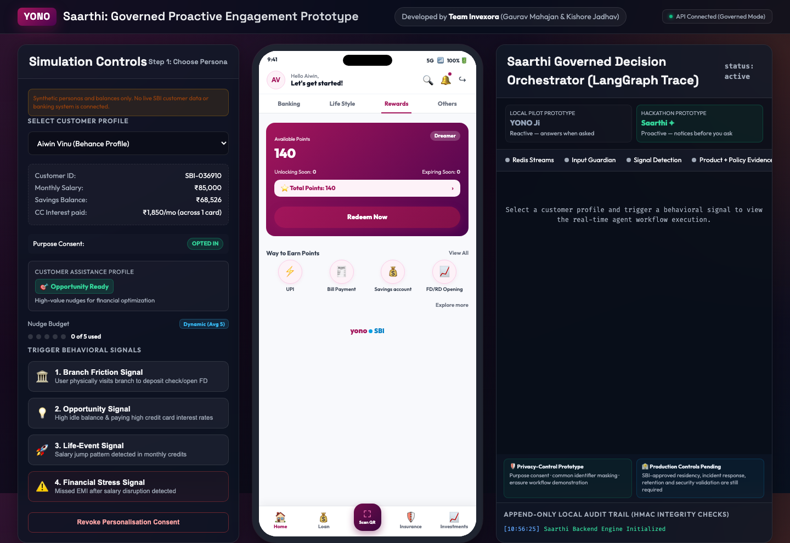
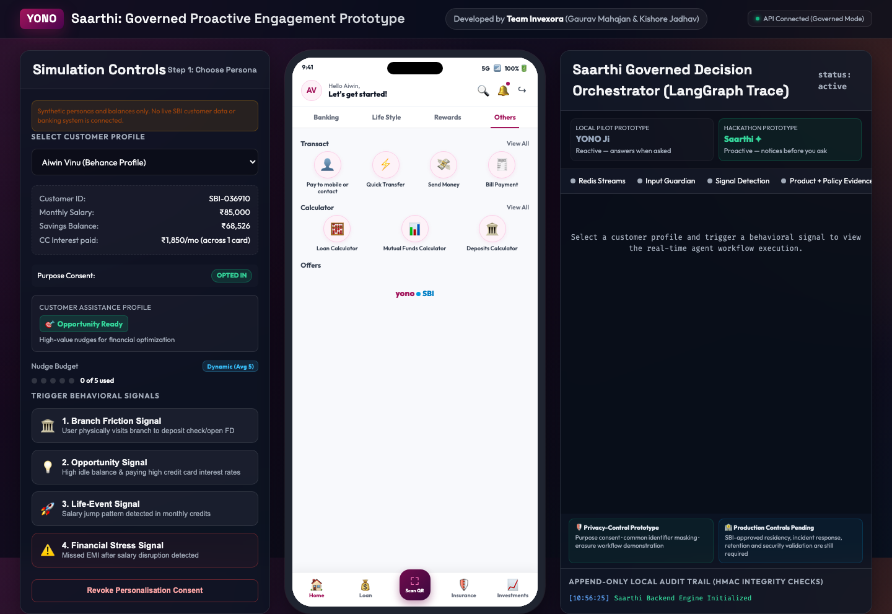
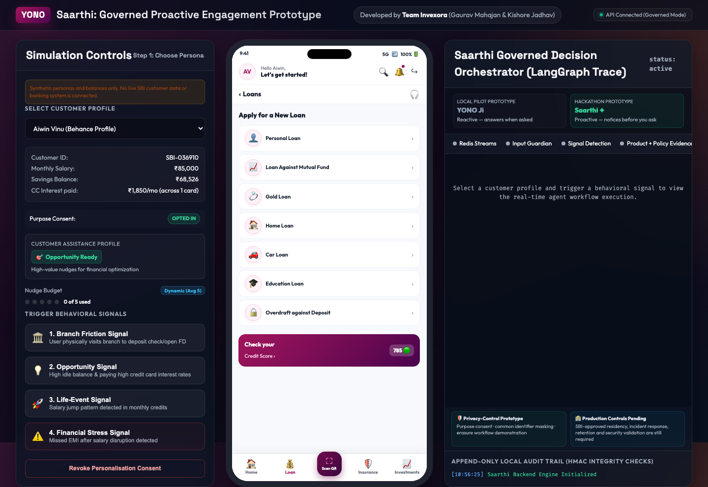
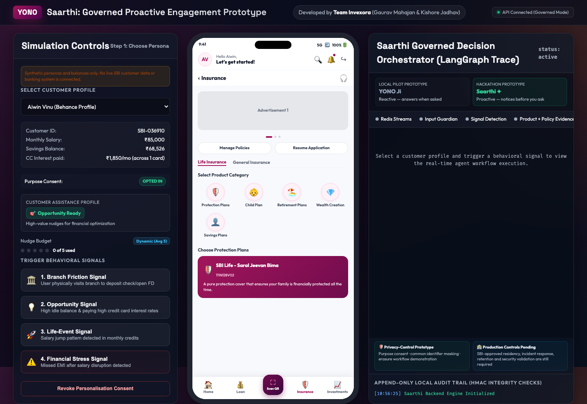
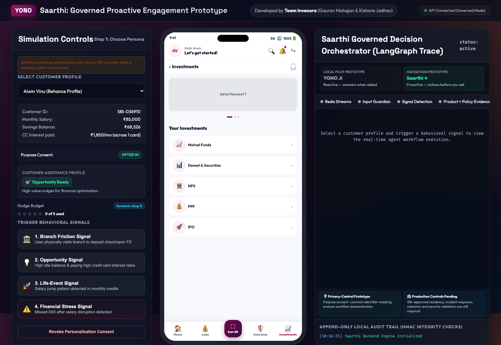
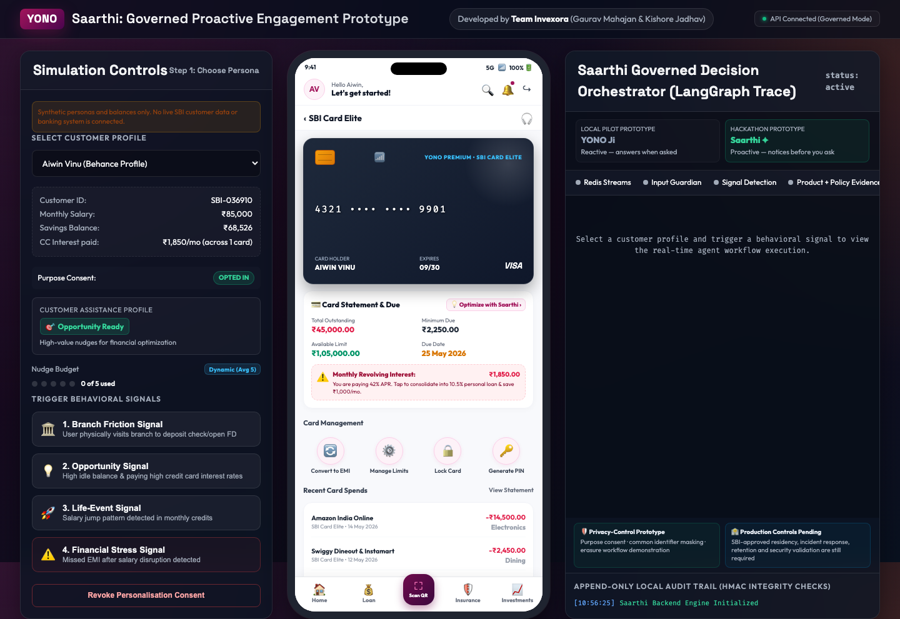
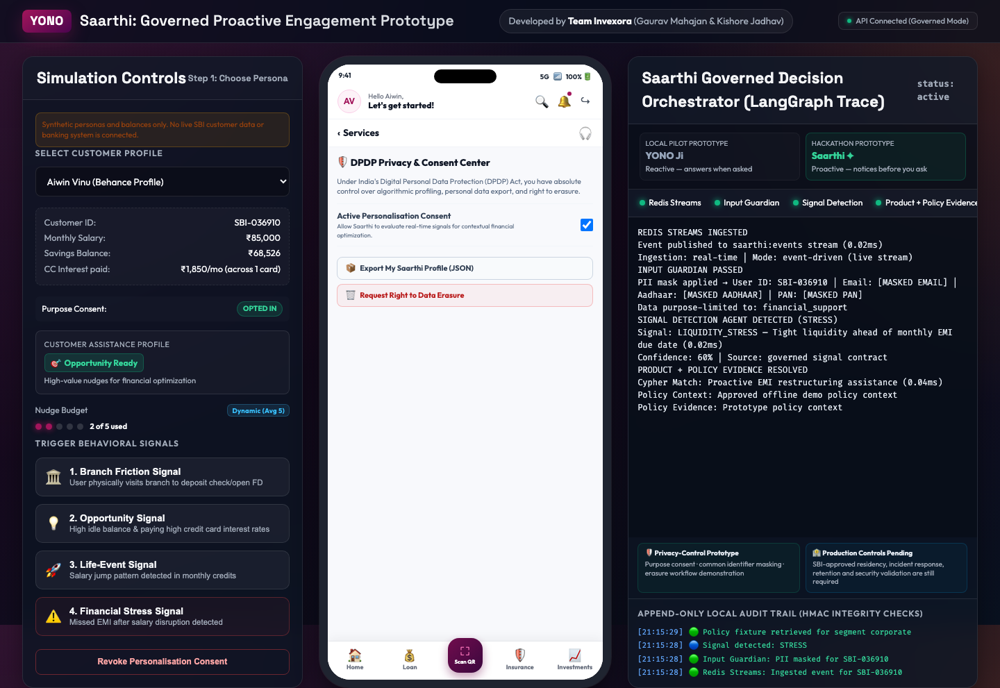
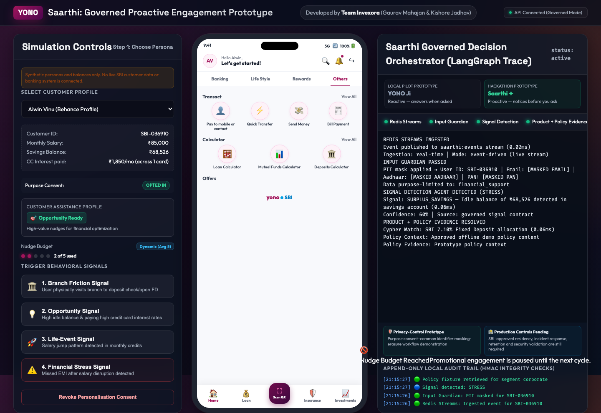
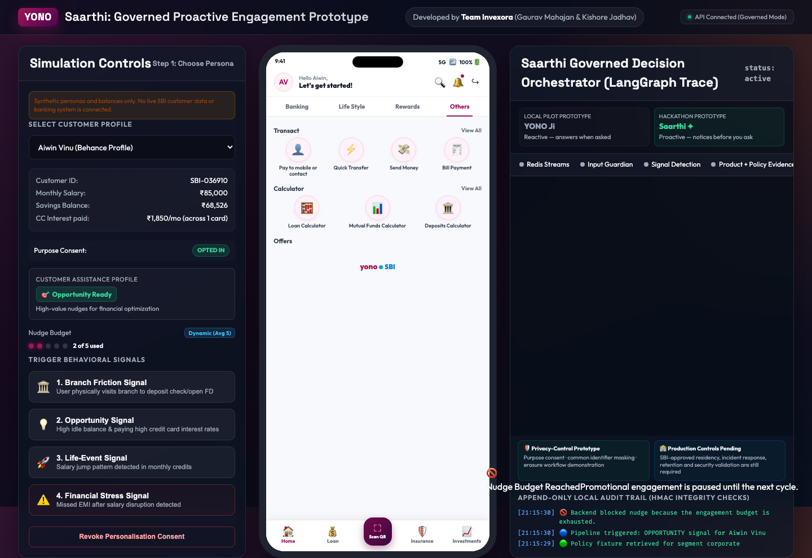
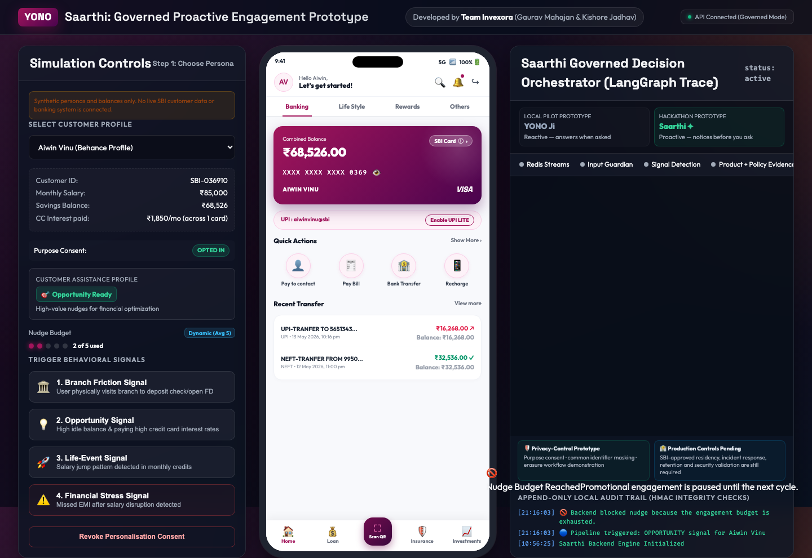

# State Bank of India — Saarthi YONO UI & Nudge Screenshot Gallery

> **Live Deployed Prototype:** [https://invexora.github.io/saarthi-yono-copilot/](https://invexora.github.io/saarthi-yono-copilot/)
> **Repository:** [https://github.com/invexora/saarthi-yono-copilot](https://github.com/invexora/saarthi-yono-copilot)

This document contains full visual evidence of every screen, modal, sub-journey, and proactive nudge state implemented for **Saarthi YONO Co-Pilot**.

---

## 📱 1. Authentic Login Experiences

| MPIN 3x4 Circular Keypad & Biometrics | Username & Password with Virtual GBoard |
| :---: | :---: |
|  |  |

---

## 💳 2. Main Dashboard (4 Category Tabs)

| Banking (Magenta Wave Card & UPI LITE) | Life Style (Travel, Offers & Services) |
| :---: | :---: |
|  |  |
| **Rewards (Available Points & Redeem)** | **Others (Transact & Calculators)** |
|  |  |

---

## 📑 3. Dedicated Financial Sub-Screens & Modals

| Loans Sub-Screen | Insurance Sub-Screen |
| :---: | :---: |
|  |  |
| **Investments Sub-Screen** | **3D SBI Card Elite & Statement Optimizer** |
|  |  |
| **Account Details & Profile Modal** | **DPDP Privacy & Consent Center** |
|  |  |

---

## 💡 4. Proactive Governed In-App Nudges

| Opportunity Nudge (Debt Consolidation) | Explainability Accordion ("Why am I seeing this?") |
| :---: | :---: |
|  |  |
| **Branch Friction Nudge (CDM & UPI LITE)** | **Life-Event Nudge (SBI Green Fixed Deposit)** |
|  |  |
| **Financial Stress Mode (Compassionate RM)** | **Action Authorization & Single-Use Token Modal** |
|  |  |

---

## 🏆 5. Action Execution & Cryptographic Settlement

| Action Authorization Modal | Post-Execution Governed State |
| :---: | :---: |
|  |  |
