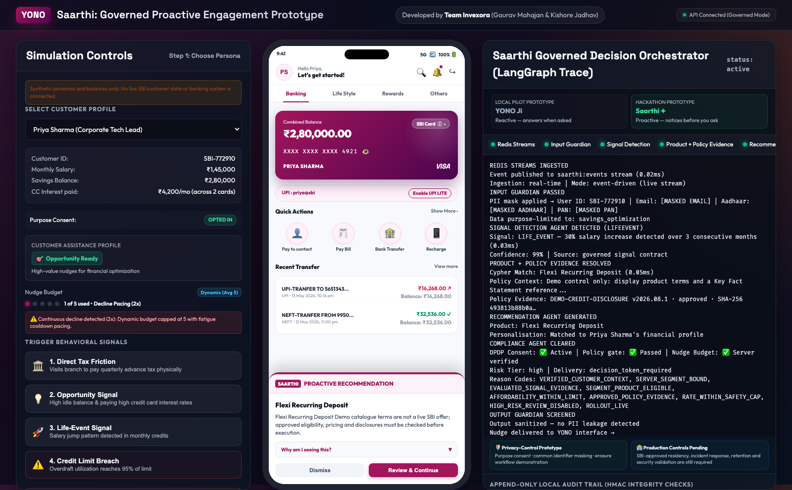
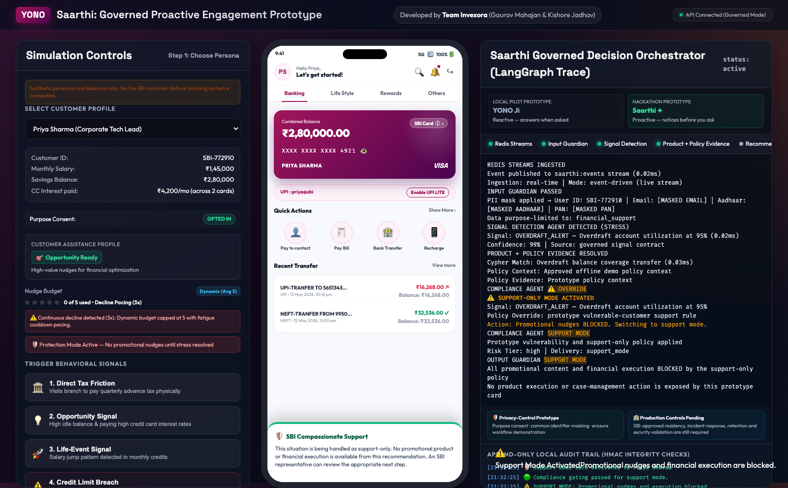
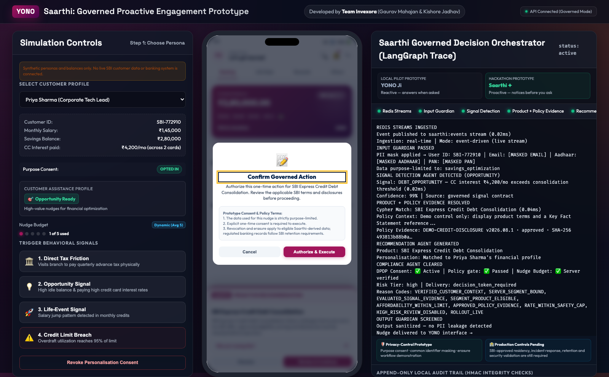
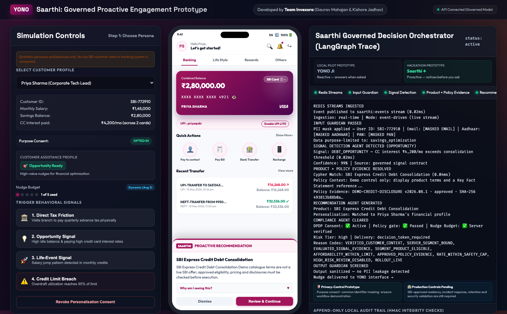
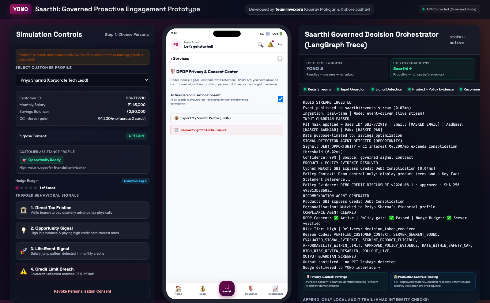
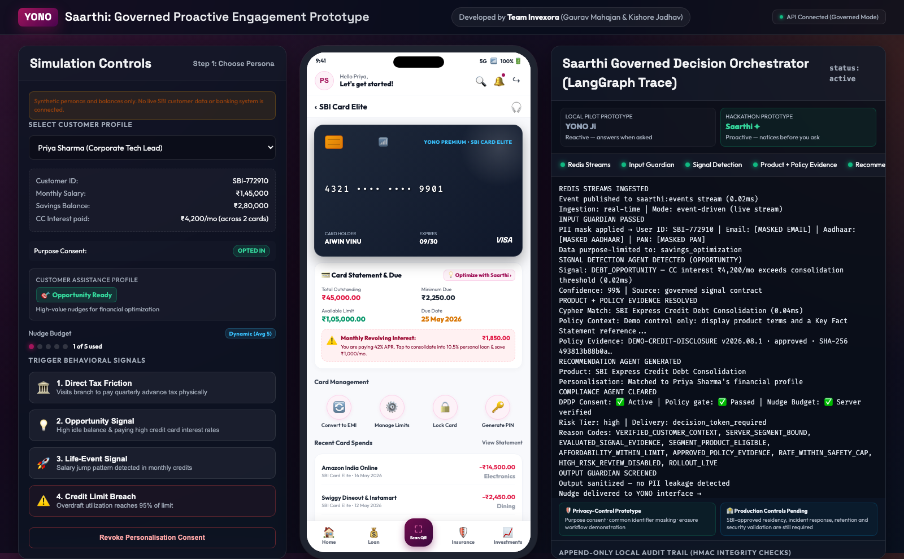
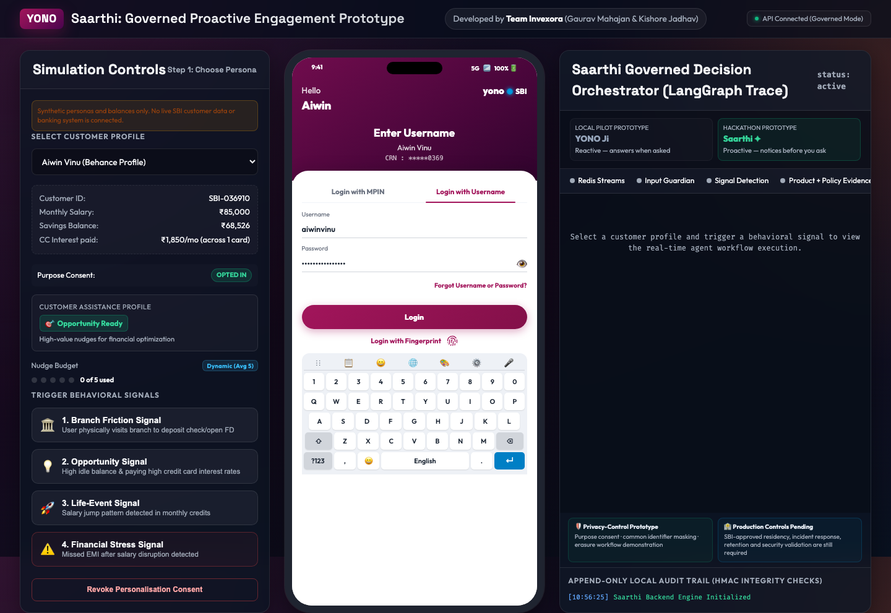

# State Bank of India — Saarthi Co-Pilot Solution Screenshots & Behavioral Traces

> **Live Deployed Prototype:** [https://invexora.github.io/saarthi-yono-copilot/](https://invexora.github.io/saarthi-yono-copilot/)
> **Default Customer Persona:** **Priya Sharma** (Corporate Tech Lead, SBI-772910, ₹1,45,000 salary, ₹2,80,000 savings balance)
> **Decision Engine:** Compiled 6-Node LangGraph State Machine with DPDP Act 2023 Consent Gate & Single-Use HMAC Decision Tokens

This gallery documents **our core solutions, proactive in-app nudges, and real-time agentic decision traces** across customer behavioral signals.

---

## 🎯 1. Our Core Solutions (3-Panel Live Co-Pilot Experience)

### Solution 1: Credit Card Debt Optimization & Explainability (Opportunity Signal)
When revolving credit card debt incurring 42% APR is detected, Saarthi calculates consolidation savings into an SBI personal loan/EMI and displays transparent governance reason codes.

| Proactive Debt Consolidation Nudge & LangGraph Trace | Explainability Accordion & DPDP Rule Transparency |
| :---: | :---: |
|  |  |

---

### Solution 2: Direct Tax Friction & Surplus Life-Event Allocation
Proactively routing physical branch counter visitors to digital payments, and auto-allocating salary hike surpluses into 7.10% SBI deposits.

| Branch Friction: Direct Tax Instant Digital Payment | Life-Event: 30% Salary Jump -> 7.10% Recurring Deposit |
| :---: | :---: |
|  |  |

---

### Solution 3: Financial Stress Mode & Compassionate Support Circuit Breaker
When financial vulnerability or liquidity stress is detected, all promotional cross-selling is **BLOCKED** by the Compliance Node, switching the interface to compassionate Relationship Manager support.

| Vulnerability Protection Mode (Marketing Blocked) | Cryptographic Single-Use Authorization Modal |
| :---: | :---: |
|  |  |

---

### Solution 4: DPDP Privacy Center, Dynamic Budgets & Card Optimizer

| Dynamic 5-Dot Budget & Decline Fatigue Pacing | DPDP Act 2023 Consent, Erasure & Export Center |
| :---: | :---: |
|  |  |
| **Tamper-Evident SHA-256 HMAC Audit Trail** | **3D SBI Card Elite & Revolving Debt Optimizer** |
|  |  |

---

## 📱 2. Base YONO Mobile Interface Views

| MPIN 3x4 Circular Keypad & Biometrics | Username & Password with Virtual GBoard |
| :---: | :---: |
|  |  |
| **Banking Dashboard (Magenta Wave Card)** | **Account Details & Profile Modal** |
|  |  |
